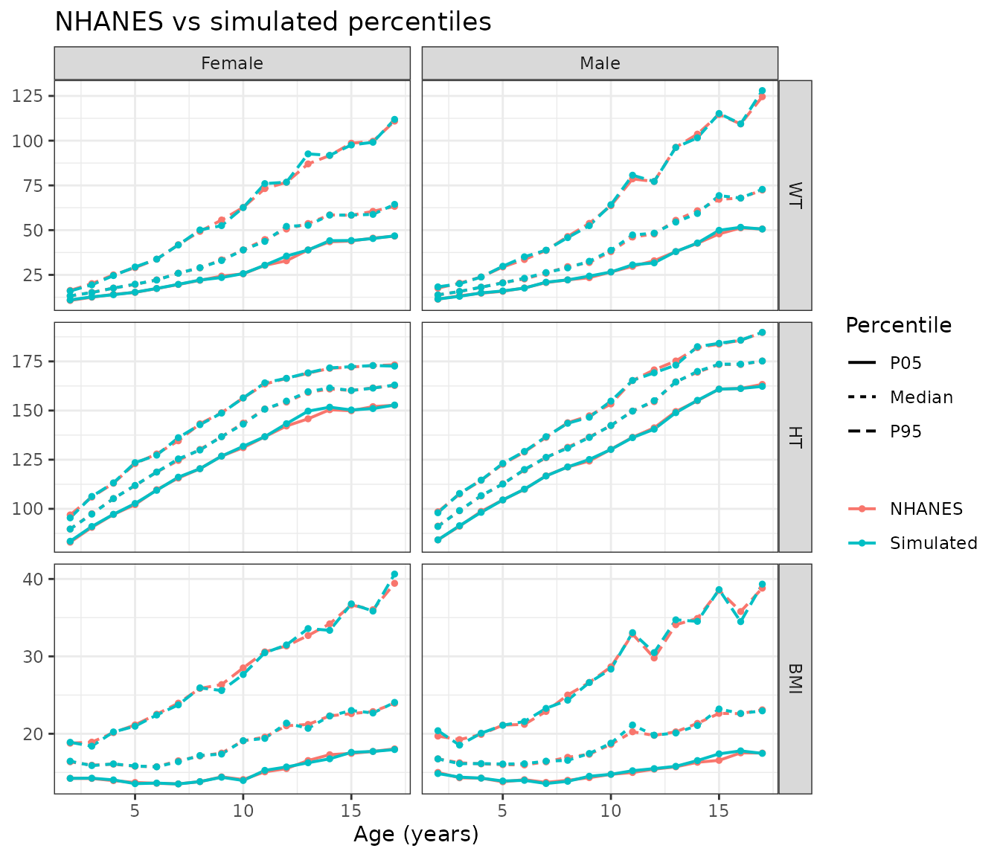

# Simulating pediatric body size from NHANES

``` r

library(pmxTools)
```

Pediatric simulations need realistic covariates. Body weight drives
allometric scaling of clearance and volume, and weight-based or
body-surface-area-based dosing needs weight and height that belong
together.
[`sample_nhanes()`](https://kestrel99.github.io/pmxTools/reference/sample_nhanes.md)
generates virtual children aged 2 to 17 years with body weight and/or
standing height drawn from the US National Health and Nutrition
Examination Survey (NHANES).

## The reference data

The package includes `nhanes_peds`, with one row per child from four
NHANES releases (2013-2014 to 2021-2023):

``` r

head(nhanes_peds)
#>     CYCLE  SEQN AGE_MONTHS AGE    SEX   WT     HT    MEC_WT
#> 1 2013-14 73560        119   9   Male 32.2 137.30 55766.512
#> 2 2013-14 73570        109   9 Female 31.9 135.50 12071.467
#> 3 2013-14 73572        125  10 Female 41.7 145.40 12764.396
#> 4 2013-14 73573        128  10   Male 50.1 158.38  6460.788
#> 5 2013-14 73576        194  16   Male 67.3 170.40 12665.770
#> 6 2013-14 73579        147  12 Female 40.2 161.00 70708.034
table(nhanes_peds$CYCLE)
#> 
#> 2013-14 2015-16 2017-18 2021-23 
#>    3241    3138    2593    2258
```

Each child has a mobile examination center (MEC) exam weight (`MEC_WT`),
which NHANES provides so that its sample represents the US population. A
few children have only one of weight or height measured. They are kept,
and are used whenever the missing measure isn’t needed.

## Simulating a population

[`sample_nhanes()`](https://kestrel99.github.io/pmxTools/reference/sample_nhanes.md)
simulates `n` children (500 by default) per age (in whole years) and
sex:

``` r

sim <- sample_nhanes(seed = 20261008)
sim
#> # A tibble: 16,000 × 8
#>       ID   AGE  SEXN SEX      WT    HT SOURCE_CYCLE SOURCE_SEQN
#>    <int> <int> <int> <chr> <dbl> <dbl> <chr>              <dbl>
#>  1     1     2     1 Male   13.7  90.7 2013-14            81515
#>  2     2     2     1 Male   13.4  91.6 2015-16            90822
#>  3     3     2     1 Male   13.5  87   2021-23           136484
#>  4     4     2     1 Male   15.3  93.5 2015-16            84344
#>  5     5     2     1 Male   11.7  83.1 2013-14            73710
#>  6     6     2     1 Male   12.6  87.1 2015-16            85690
#>  7     7     2     1 Male   14.3  94.6 2015-16            84670
#>  8     8     2     1 Male   14.9  98   2013-14            75617
#>  9     9     2     1 Male   12.4  93   2021-23           130853
#> 10    10     2     1 Male   13    92.7 2013-14            74811
#> # ℹ 15,990 more rows
```

For each age and sex, it resamples real children, weighted by their MEC
exam weights with each NHANES release given an equal share. Resampling
is by child: each simulated child takes the weight and height of one
real child, so every value is one that was actually measured, and weight
and height stay paired. `SOURCE_CYCLE` and `SOURCE_SEQN` identify that
child.

Details of the reference in each age and sex group are stored with the
result:

``` r

head(attr(sim, "kernels"))
#> # A tibble: 6 × 7
#>     AGE SEX    N_NHANES N_EFF  H_WT  H_HT   RHO
#>   <int> <chr>     <int> <dbl> <dbl> <dbl> <dbl>
#> 1     2 Male        366  263.     0     0 0.735
#> 2     2 Female      381  238.     0     0 0.752
#> 3     3 Male        341  220.     0     0 0.700
#> 4     3 Female      295  196.     0     0 0.810
#> 5     4 Male        364  266.     0     0 0.742
#> 6     4 Female      357  245.     0     0 0.765
```

`N_NHANES` is the number of reference children, `N_EFF` their effective
sample size after weighting, and `RHO` the weighted correlation between
log weight and log height. `H_WT` and `H_HT` are 0 here; they are the
noise used by the smoothed method described below.

## Checking the simulation

[`compare_nhanes()`](https://kestrel99.github.io/pmxTools/reference/compare_nhanes.md)
summarises weight, height and body mass index for the simulated
population and for the weighted NHANES reference it came from:

``` r

cmp <- compare_nhanes(sim)
cmp[cmp$AGE == 10, c("SEX", "VARIABLE", "Median_REF", "Median_SIM",
                     "P05_RATIO", "P95_RATIO", "RHO_REF", "RHO_SIM")]
#> # A tibble: 6 × 8
#>   SEX    VARIABLE Median_REF Median_SIM P05_RATIO P95_RATIO RHO_REF RHO_SIM
#>   <chr>  <chr>         <dbl>      <dbl>     <dbl>     <dbl>   <dbl>   <dbl>
#> 1 Male   WT             38         38.7     1         1.01    0.676   0.687
#> 2 Male   HT            142.       142.      0.999     1.01    0.676   0.687
#> 3 Male   BMI            18.6       18.8     1.00      0.990   0.676   0.687
#> 4 Female WT             38.9       38.9     1.01      0.999   0.730   0.737
#> 5 Female HT            144.       143.      1.01      1       0.730   0.737
#> 6 Female BMI            19.1       19.1     0.991     0.970   0.730   0.737
```

[`plot_nhanes()`](https://kestrel99.github.io/pmxTools/reference/plot_nhanes.md)
shows the 5th, 50th and 95th percentiles against age:

``` r

plot_nhanes(cmp)
```



Body mass index is included because it depends on weight and height
together. If it matches the reference, the relationship between the two
has been kept, not just each measure on its own. The 5th and 95th
percentiles of weight vary more from run to run than the medians,
because weight has a long upper tail; increase `n` if the tails matter
for your simulation.

## Options

Simulate a subset of ages, one sex, or a single measure. With
`vars = "WT"`, children whose height is missing are also used:

``` r

wt <- sample_nhanes(n = 100, ages = 6:12, sex = "Female", vars = "WT",
                    seed = 1)
head(wt)
#> # A tibble: 6 × 7
#>      ID   AGE  SEXN SEX       WT SOURCE_CYCLE SOURCE_SEQN
#>   <int> <int> <int> <chr>  <dbl> <chr>              <dbl>
#> 1     1     6     2 Female  24.4 2021-23           138289
#> 2     2     6     2 Female  24.1 2015-16            85673
#> 3     3     6     2 Female  23.4 2021-23           132599
#> 4     4     6     2 Female  29.6 2015-16            91186
#> 5     5     6     2 Female  20.9 2021-23           133204
#> 6     6     6     2 Female  21.3 2015-16            88053
```

`cycles` restricts the reference to particular NHANES releases, for
example the most recent one only:

``` r

recent <- sample_nhanes(n = 100, ages = 2:5, cycles = "2021-23", seed = 1)
table(recent$SOURCE_CYCLE)
#> 
#> 2021-23 
#>     800
```

## Smoothed values

Resampled values repeat those of the reference children. If a simulation
needs continuous values instead, `method = "smooth"` adds a small amount
of random noise to each resampled child’s log weight and log height. The
noise for weight and height is correlated like the reference data, so a
tall child stays heavier than a short one of the same age:

``` r

smoothed <- sample_nhanes(n = 500, ages = c(4, 10, 16), method = "smooth",
                          seed = 20261008)
head(smoothed)
#> # A tibble: 6 × 8
#>      ID   AGE  SEXN SEX      WT    HT SOURCE_CYCLE SOURCE_SEQN
#>   <int> <int> <int> <chr> <dbl> <dbl> <chr>              <dbl>
#> 1     1     4     1 Male   23.4 108.  2013-14            81253
#> 2     2     4     1 Male   18.0 104.  2015-16            90807
#> 3     3     4     1 Male   22.3 109.  2021-23           134520
#> 4     4     4     1 Male   18.3 103.  2015-16            83780
#> 5     5     4     1 Male   15.1  98.6 2013-14            73646
#> 6     6     4     1 Male   12.9  95.6 2021-23           137398
attr(smoothed, "kernels")
#> # A tibble: 6 × 7
#>     AGE SEX    N_NHANES N_EFF   H_WT   H_HT   RHO
#>   <int> <chr>     <int> <dbl>  <dbl>  <dbl> <dbl>
#> 1     4 Male        364  266. 0.0501 0.0161 0.742
#> 2     4 Female      357  245. 0.0572 0.0178 0.765
#> 3    10 Male        364  248. 0.0879 0.0184 0.676
#> 4    10 Female      359  238. 0.0998 0.0178 0.730
#> 5    16 Male        317  209. 0.0908 0.0155 0.407
#> 6    16 Female      355  216. 0.0824 0.0143 0.347
```

`H_WT` and `H_HT` are the noise standard deviations on the log scale
(0.05 is roughly 5%). `bandwidth_factor` scales them: values above 1
smooth more. Check smoothed populations with
[`compare_nhanes()`](https://kestrel99.github.io/pmxTools/reference/compare_nhanes.md)
in the same way.

## Using the population in a PK simulation

The result is an ordinary data frame, so derived covariates are one step
away. For example, body surface area (Mosteller) and an allometrically
scaled clearance for a typical value of 10 L/h at 70 kg:

``` r

sim$BSA <- sqrt(sim$WT * sim$HT / 3600)
sim$CL <- 10 * (sim$WT / 70)^0.75
head(sim[c("ID", "AGE", "SEX", "WT", "HT", "BSA", "CL")])
#> # A tibble: 6 × 7
#>      ID   AGE SEX      WT    HT   BSA    CL
#>   <int> <int> <chr> <dbl> <dbl> <dbl> <dbl>
#> 1     1     2 Male   13.7  90.7 0.588  2.94
#> 2     2     2 Male   13.4  91.6 0.584  2.89
#> 3     3     2 Male   13.5  87   0.571  2.91
#> 4     4     2 Male   15.3  93.5 0.630  3.20
#> 5     5     2 Male   11.7  83.1 0.520  2.61
#> 6     6     2 Male   12.6  87.1 0.552  2.76
```
