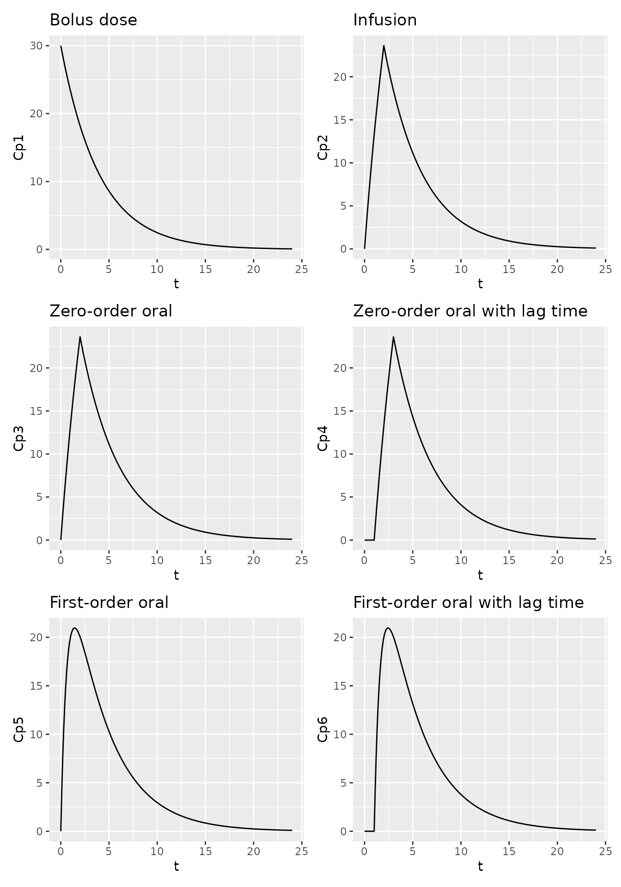
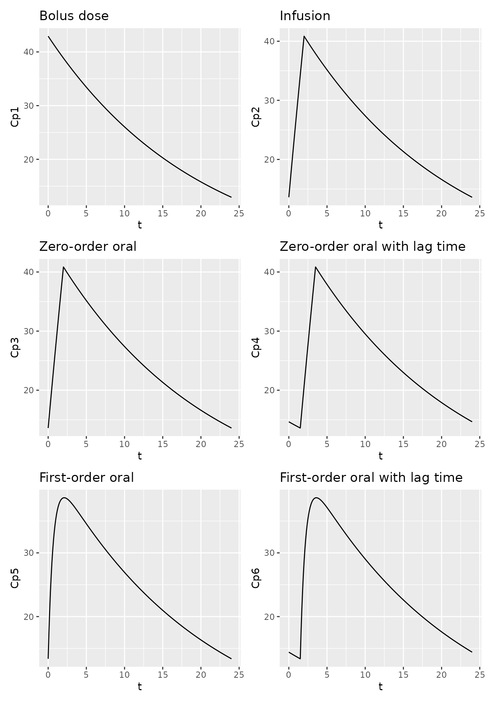
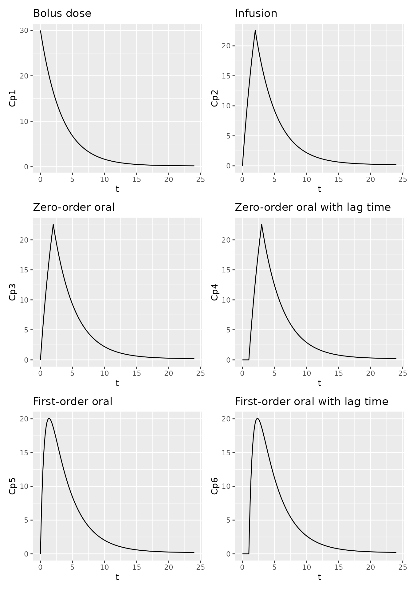
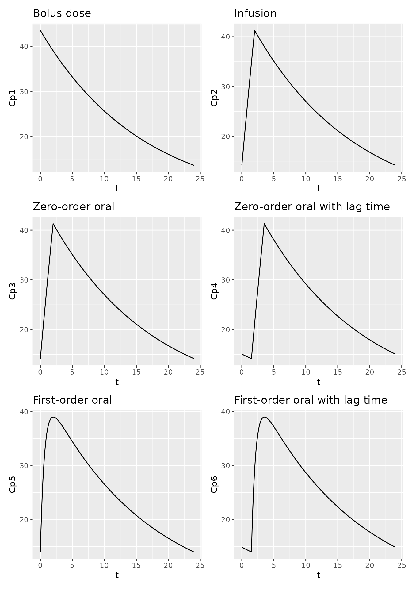
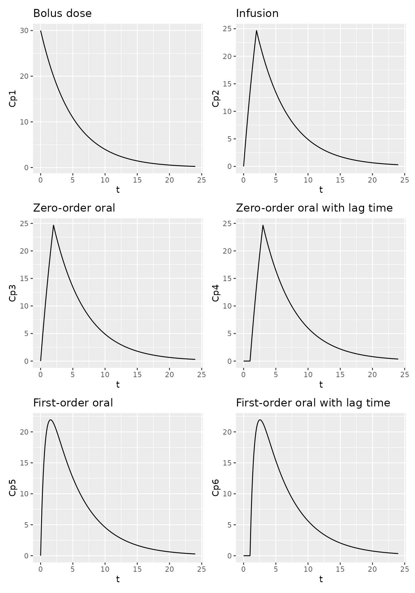
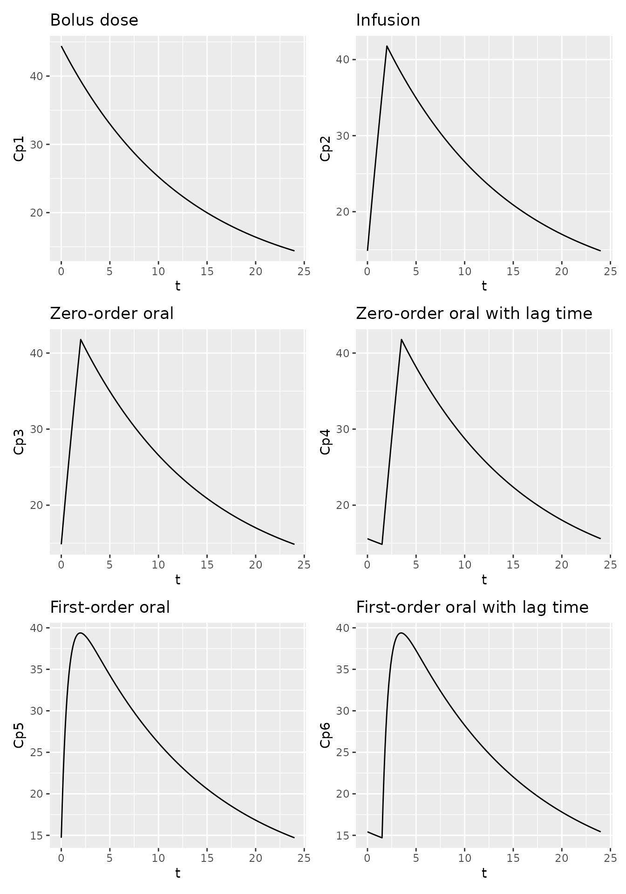
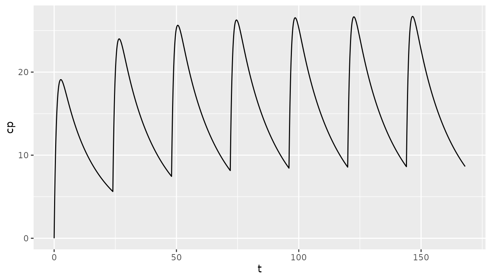

# Drawing PK curves with pmxTools

``` r

library(pmxTools)
library(patchwork)
```

`pmxTools` includes functions for constructing pharmacokinetic (PK)
concentration-time curves for a range of common compartmental systems
using PK parameters and microconstants. The underlying solutions are
based on Julie Bertrand and France Mentré’s [Mathematical Expressions of
the Pharmacokinetic and Pharmacodynamic Models implemented in the
Monolix
software](https://www.facm.ucl.ac.be/cooperation/Vietnam/WBI-Vietnam-October-2011/Modelling/Monolix32_PKPD_library.pdf),
published in 2008.

The options available are by necessity confined to one-, two- and
three-compartmental linear models with intravenous bolus, infusion or
oral dosing (the latter with zero- or first-order absorption). If more
complex systems are needed, you are probably better off using an
ODE-based simulation package such as
[`rxode2`](https://nlmixr2.github.io/rxode2/) or
[`mrgSolve`](https://mrgsolve.org/).

## Specifying model parameters

Models take dose, time and PK parameters as inputs. Names for some PK
parameters, especially volumes and intercompartmental clearances, vary
by model type.

| Parameter | Description | Used for |
|----|----|----|
| `t` | Time | Single-dose |
| `tad` | Time after last dose | Steady state |
| `dose` | Dose | All |
| `CL` | Clearance | All |
| `V`, `V1` | Central volume of distribution | All |
| `V2` | First peripheral volume of distribution | Two- and three-compartment models |
| `V3` | Second peripheral volume of distribution | Three-compartment models |
| `Q`, `Q1`, `Q2` | Intercompartmental clearance (between V1 and V2) | Two- and three-compartment models |
| `Q3` | Intercompartmental clearance (between V1 and V3) | Three-compartment models |
| `tlag` | Lag time | Models with lag time |
| `tinf` | Duration of infusion | Models with infusion |
| `dur` | Duration of zero-order absorption | Models with zero-order absorption |
| `ka` | First-order absorption rate | Models with first-order absorption |

## One-compartment, single dose

Available functions include:

| Model | Variant | Call |
|----|----|----|
| 1-compartment | Single-dose, bolus | `calc_sd_1cmt_linear_bolus(t, dose, CL, V)` |
|   | Single-dose, infusion | `calc_sd_1cmt_linear_infusion(t, dose, CL, V, tinf)` |
|   | Single-dose, zero-order oral absorption | `calc_sd_1cmt_linear_oral_0(t, dose, CL, V, dur)` |
|   | Single-dose, zero-order oral absorption with lag time | `calc_sd_1cmt_linear_oral_0_lag(t, dose, CL, V, dur, tlag)` |
|   | Single-dose, first-order oral absorption | `calc_sd_1cmt_linear_oral_1(t, dose, CL, V, ka)` |
|   | Single-dose, first-order oral absorption with lag time | `calc_sd_1cmt_linear_oral_1_lag(t, dose, CL, V, ka, tlag)` |

For example -

``` r


library(ggplot2)

t <- seq(0, 24, by=0.1)

df1 <- data.frame(t = t,
                  Cp1 = calc_sd_1cmt_linear_bolus(t = t, dose = 600, CL = 5, V = 20),
                  Cp2 = calc_sd_1cmt_linear_infusion(t = t, dose = 600, CL = 5, V = 20, tinf=2),
                  Cp3 = calc_sd_1cmt_linear_oral_0(t = t, dose = 600, CL = 5, V = 20, dur=2),
                  Cp4 = calc_sd_1cmt_linear_oral_0_lag(t = t, dose = 600, CL = 5, V = 20, dur=2, tlag=1),
                  Cp5 = calc_sd_1cmt_linear_oral_1(t = t, dose = 600, CL = 5, V = 20, ka=1.5),
                  Cp6 = calc_sd_1cmt_linear_oral_1_lag(t = t, dose = 600, CL = 5, V = 20, ka=1.5, tlag=1))

p1.1 <- ggplot(df1, aes(t, Cp1)) +
  geom_line() +
  labs(title="Bolus dose")

p1.2 <- ggplot(df1, aes(t, Cp2)) +
  geom_line() +
  labs(title="Infusion")

p1.3 <- ggplot(df1, aes(t, Cp3)) +
  geom_line() +
  labs(title="Zero-order oral")

p1.4 <- ggplot(df1, aes(t, Cp4)) +
  geom_line() +
  labs(title="Zero-order oral with lag time")

p1.5 <- ggplot(df1, aes(t, Cp5)) +
  geom_line() +
  labs(title="First-order oral")

p1.6 <- ggplot(df1, aes(t, Cp6)) +
  geom_line() +
  labs(title="First-order oral with lag time")

p1.1 + p1.2 + p1.3 + p1.4 + p1.5 + p1.6 + plot_layout(nrow=3)
```



## One-compartment, steady state

Available functions include:

| Model | Variant | Call |
|----|----|----|
| 1-compartment | Steady state, bolus | `calc_ss_1cmt_linear_bolus(tad, tau, dose, CL, V)` |
|   | Steady state, infusion | `calc_ss_1cmt_linear_infusion(tad, tau, dose, CL, V, tinf)` |
|   | Steady state, zero-order oral absorption | `calc_ss_1cmt_linear_oral_0(tad, tau, dose, CL, V, dur)` |
|   | Steady state, zero-order oral absorption with lag time | `calc_ss_1cmt_linear_oral_0_lag(tad, tau, dose, CL, V, dur, tlag)` |
|   | Steady state, first-order oral absorption | `calc_ss_1cmt_linear_oral_1(tad, tau, dose, CL, V, ka)` |
|   | Steady state, first-order oral absorption with lag time | `calc_ss_1cmt_linear_oral_1_lag(tad, tau, dose, CL, V, ka, tlag)` |

For example -

``` r


t <- seq(0, 24, by=0.1)

df1ss <- data.frame(t = t,
                  Cp1 = calc_ss_1cmt_linear_bolus(t = t, tau = 24, dose = 600, CL = 1, V = 20),
                  Cp2 = calc_ss_1cmt_linear_infusion(t = t, tau = 24, dose = 600, CL = 1, V = 20, tinf=2),
                  Cp3 = calc_ss_1cmt_linear_oral_0(t = t, tau = 24, dose = 600, CL = 1, V = 20, dur=2),
                  Cp4 = calc_ss_1cmt_linear_oral_0_lag(t = t, tau = 24, dose = 600, CL = 1, V = 20, dur=2, tlag=1.5),
                  Cp5 = calc_ss_1cmt_linear_oral_1(t = t, tau = 24, dose = 600, CL = 1, V = 20, ka=1.5),
                  Cp6 = calc_ss_1cmt_linear_oral_1_lag(t = t, tau = 24, dose = 600, CL = 1, V = 20, ka=1.5, tlag=1.5))

p1.1ss <- ggplot(df1ss, aes(t, Cp1)) +
  geom_line() +
  labs(title="Bolus dose")

p1.2ss <- ggplot(df1ss, aes(t, Cp2)) +
  geom_line() +
  labs(title="Infusion")

p1.3ss <- ggplot(df1ss, aes(t, Cp3)) +
  geom_line() +
  labs(title="Zero-order oral")

p1.4ss <- ggplot(df1ss, aes(t, Cp4)) +
  geom_line() +
  labs(title="Zero-order oral with lag time")

p1.5ss <- ggplot(df1ss, aes(t, Cp5)) +
  geom_line() +
  labs(title="First-order oral")

p1.6ss <- ggplot(df1ss, aes(t, Cp6)) +
  geom_line() +
  labs(title="First-order oral with lag time")

p1.1ss + p1.2ss + p1.3ss + p1.4ss + p1.5ss + p1.6ss + plot_layout(nrow=3)
```



## Two-compartment, single dose

Available functions include:

| Model | Variant | Call |
|----|----|----|
| 2-compartment | Single-dose, bolus | `calc_sd_2cmt_linear_bolus(t, dose, CL, V1, V2, Q)` |
|   | Single-dose, infusion | `calc_sd_2cmt_linear_infusion(t, dose, CL, V1, V2, Q, tinf)` |
|   | Single-dose, zero-order oral absorption | `calc_sd_2cmt_linear_oral_0(t, dose, CL, V1, V2, Q, dur)` |
|   | Single-dose, zero-order oral absorption with lag time | `calc_sd_2cmt_linear_oral_0_lag(t, dose, CL, V1, V2, Q, dur, tlag)` |
|   | Single-dose, first-order oral absorption | `calc_sd_2cmt_linear_oral_1(t, dose, CL, V1, V2, Q, ka)` |
|   | Single-dose, first-order oral absorption with lag time | `calc_sd_2cmt_linear_oral_1_lag(t, dose, CL, V1, V2, Q, ka, tlag)` |

For example -

``` r


t <- seq(0, 24, by=0.1)

df2 <- data.frame(t = t,
                  Cp1 = calc_sd_2cmt_linear_bolus(t = t, dose = 600, CL = 5, V1 = 20, V2 = 80, Q = 1),
                  Cp2 = calc_sd_2cmt_linear_infusion(t = t, dose = 600, CL = 5, V1 = 20, V2 = 80, Q = 1, tinf=2),
                  Cp3 = calc_sd_2cmt_linear_oral_0(t = t, dose = 600, CL = 5, V1 = 20, V2 = 80, Q = 1, dur=2),
                  Cp4 = calc_sd_2cmt_linear_oral_0_lag(t = t, dose = 600, CL = 5, V1 = 20, V2 = 80, Q = 1, dur=2, tlag=1),
                  Cp5 = calc_sd_2cmt_linear_oral_1(t = t, dose = 600, CL = 5, V1 = 20, V2 = 80, Q = 1, ka=1.5),
                  Cp6 = calc_sd_2cmt_linear_oral_1_lag(t = t, dose = 600, CL = 5, V1 = 20, V2 = 80, Q = 1, ka=1.5, tlag=1))

p2.1 <- ggplot(df2, aes(t, Cp1)) +
  geom_line() +
  labs(title="Bolus dose")

p2.2 <- ggplot(df2, aes(t, Cp2)) +
  geom_line() +
  labs(title="Infusion")

p2.3 <- ggplot(df2, aes(t, Cp3)) +
  geom_line() +
  labs(title="Zero-order oral")

p2.4 <- ggplot(df2, aes(t, Cp4)) +
  geom_line() +
  labs(title="Zero-order oral with lag time")

p2.5 <- ggplot(df2, aes(t, Cp5)) +
  geom_line() +
  labs(title="First-order oral")

p2.6 <- ggplot(df2, aes(t, Cp6)) +
  geom_line() +
  labs(title="First-order oral with lag time")

p2.1 + p2.2 + p2.3 + p2.4 + p2.5 + p2.6 + plot_layout(nrow=3)
```



## Two-compartment, steady state

Available functions include:

| Model | Variant | Call |
|----|----|----|
| 2-compartment | Steady state, bolus | `calc_ss_2cmt_linear_bolus(tad, tau, dose, CL, V1, V2, Q)` |
|   | Steady state, infusion | `calc_ss_2cmt_linear_infusion(tad, tau, dose, CL, V1, V2, Q, tinf)` |
|   | Steady state, zero-order oral absorption | `calc_ss_2cmt_linear_oral_0(tad, tau, dose, CL, V1, V2, Q, dur)` |
|   | Steady state, zero-order oral absorption with lag time | `calc_ss_2cmt_linear_oral_0_lag(tad, tau, dose, CL, V1, V2, Q, dur, tlag)` |
|   | Steady state, first-order oral absorption | `calc_ss_2cmt_linear_oral_1(tad, tau, dose, CL, V1, V2, Q, ka)` |
|   | Steady state, first-order oral absorption with lag time | `calc_ss_2cmt_linear_oral_1_lag(tad, tau, dose, CL, V1, V2, Q, ka, tlag)` |

For example -

``` r


t <- seq(0, 24, by=0.1)

df2ss <- data.frame(t = t,
                  Cp1 = calc_ss_2cmt_linear_bolus(tad = t, tau = 24, dose = 600, CL = 1, V1 = 20, V2 = 80, Q = 0.25),
                  Cp2 = calc_ss_2cmt_linear_infusion(tad = t, tau = 24, dose = 600, CL = 1, V1 = 20, V2 = 80, Q = 0.25, tinf=2),
                  Cp3 = calc_ss_2cmt_linear_oral_0(tad = t, tau = 24, dose = 600, CL = 1, V1 = 20, V2 = 80, Q = 0.25, dur=2),
                  Cp4 = calc_ss_2cmt_linear_oral_0_lag(tad = t, tau = 24, dose = 600, CL = 1, V1 = 20, V2 = 80, Q = 0.25, dur=2, tlag=1.5),
                  Cp5 = calc_ss_2cmt_linear_oral_1(tad = t, tau = 24, dose = 600, CL = 1, V1 = 20, V2 = 80, Q = 0.25, ka=1.5),
                  Cp6 = calc_ss_2cmt_linear_oral_1_lag(tad = t, tau = 24, dose = 600, CL = 1, V1 = 20, V2 = 80, Q = 0.25, ka=1.5, tlag=1.5))

p2.1ss <- ggplot(df2ss, aes(t, Cp1)) +
  geom_line() +
  labs(title="Bolus dose")

p2.2ss <- ggplot(df2ss, aes(t, Cp2)) +
  geom_line() +
  labs(title="Infusion")

p2.3ss <- ggplot(df2ss, aes(t, Cp3)) +
  geom_line() +
  labs(title="Zero-order oral")

p2.4ss <- ggplot(df2ss, aes(t, Cp4)) +
  geom_line() +
  labs(title="Zero-order oral with lag time")

p2.5ss <- ggplot(df2ss, aes(t, Cp5)) +
  geom_line() +
  labs(title="First-order oral")

p2.6ss <- ggplot(df2ss, aes(t, Cp6)) +
  geom_line() +
  labs(title="First-order oral with lag time")

p2.1ss + p2.2ss + p2.3ss + p2.4ss + p2.5ss + p2.6ss + plot_layout(nrow=3)
```



## Three-compartment, single dose

Available functions include:

| Model | Variant | Call |
|----|----|----|
| 3-compartment | Single-dose, bolus | `calc_sd_3cmt_linear_bolus(t, dose, CL, V1, V2, V3, Q2, Q3)` |
|   | Single-dose, infusion | `calc_sd_3cmt_linear_infusion(t, dose, CL, V1, V2, V3, Q2, Q3, tinf)` |
|   | Single-dose, zero-order oral absorption | `calc_sd_3cmt_linear_oral_0(t, dose, CL, V1, V2, V3, Q2, Q3, dur)` |
|   | Single-dose, zero-order oral absorption with lag time | `calc_sd_3cmt_linear_oral_0_lag(t, dose, CL, V1, V2, V3, Q2, Q3, dur, tlag)` |
|   | Single-dose, first-order oral absorption | `calc_sd_3cmt_linear_oral_1(t, dose, CL, V1, V2, V3, Q2, Q3, ka)` |
|   | Single-dose, first-order oral absorption with lag time | `calc_sd_3cmt_linear_oral_1_lag(t, dose, CL, V1, V2, V3, Q2, Q3, ka, tlag)` |

For example -

``` r


t <- seq(0, 24, by=0.1)

df3 <- data.frame(t = t,
                  Cp1 = calc_sd_3cmt_linear_bolus(t = t, CL = 3.5, V1 = 20, V2 = 500, V3 = 200, Q2 = 0.5, Q3 = 0.05, dose = 600),
                  Cp2 = calc_sd_3cmt_linear_infusion(t = t, CL = 3.5, V1 = 20, V2 = 500, V3 = 200, Q2 = 0.5, Q3 = 0.05, dose = 600, tinf=2),
                  Cp3 = calc_sd_3cmt_linear_oral_0(t = t, CL = 3.5, V1 = 20, V2 = 500, V3 = 200, Q2 = 0.5, Q3 = 0.05, dose = 600, dur=2),
                  Cp4 = calc_sd_3cmt_linear_oral_0_lag(t = t, CL = 3.5, V1 = 20, V2 = 500, V3 = 200, Q2 = 0.5, Q3 = 0.05, dose = 600, dur=2, tlag=1),
                  Cp5 = calc_sd_3cmt_linear_oral_1(t = t, CL = 3.5, V1 = 20, V2 = 500, V3 = 200, Q2 = 0.5, Q3 = 0.05, dose = 600, ka=1.5),
                  Cp6 = calc_sd_3cmt_linear_oral_1_lag(t = t, CL = 3.5, V1 = 20, V2 = 500, V3 = 200, Q2 = 0.5, Q3 = 0.05, dose = 600, ka=1.5, tlag=1))

p3.1 <- ggplot(df3, aes(t, Cp1)) +
  geom_line() +
  labs(title="Bolus dose")

p3.2 <- ggplot(df3, aes(t, Cp2)) +
  geom_line() +
  labs(title="Infusion")

p3.3 <- ggplot(df3, aes(t, Cp3)) +
  geom_line() +
  labs(title="Zero-order oral")

p3.4 <- ggplot(df3, aes(t, Cp4)) +
  geom_line() +
  labs(title="Zero-order oral with lag time")

p3.5 <- ggplot(df3, aes(t, Cp5)) +
  geom_line() +
  labs(title="First-order oral")

p3.6 <- ggplot(df3, aes(t, Cp6)) +
  geom_line() +
  labs(title="First-order oral with lag time")

p3.1 + p3.2 + p3.3 + p3.4 + p3.5 + p3.6  + plot_layout(nrow=3)
```



## Three-compartment, steady state

Available functions include:

| Model | Variant | Call |
|----|----|----|
| 3-compartment | Single-dose, bolus | `calc_ss_3cmt_linear_bolus(tad, tau, dose, CL, V1, V2, V3, Q2, Q3)` |
|   | Single-dose, infusion | `calc_ss_3cmt_linear_infusion(tad, tau, dose, CL, V1, V2, V3, Q2, Q3, tinf)` |
|   | Single-dose, zero-order oral absorption | `calc_ss_3cmt_linear_oral_0(tad, tau, dose, CL, V1, V2, V3, Q2, Q3, dur)` |
|   | Single-dose, zero-order oral absorption with lag time | `calc_ss_3cmt_linear_oral_0_lag(tad, tau, dose, CL, V1, V2, V3, Q2, Q3, dur, tlag)` |
|   | Single-dose, first-order oral absorption | `calc_ss_3cmt_linear_oral_1(tad, tau, dose, CL, V1, V2, V3, Q2, Q3, ka)` |
|   | Single-dose, first-order oral absorption with lag time | `calc_ss_3cmt_linear_oral_1_lag(tad, tau, dose, CL, V1, V2, V3, Q2, Q3, ka, tlag)` |

For example -

``` r


t <- seq(0, 24, by=0.1)

df3ss <- data.frame(t = t,
                  Cp1 = calc_ss_3cmt_linear_bolus(tad = t, tau = 24, dose = 600, CL = 1, V1 = 20, V2 = 500, V3 = 200, Q2 = 0.5, Q3 = 0.05),
                  Cp2 = calc_ss_3cmt_linear_infusion(tad = t, tau = 24, dose = 600, CL = 1, V1 = 20, V2 = 500, V3 = 200, Q2 = 0.5, Q3 = 0.05, tinf=2),
                  Cp3 = calc_ss_3cmt_linear_oral_0(tad = t, tau = 24, dose = 600, CL = 1, V1 = 20, V2 = 500, V3 = 200, Q2 = 0.5, Q3 = 0.05, dur=2),
                  Cp4 = calc_ss_3cmt_linear_oral_0_lag(tad = t, tau = 24, dose = 600, CL = 1, V1 = 20, V2 = 500, V3 = 200, Q2 = 0.5, Q3 = 0.05, dur=2, tlag=1.5),
                  Cp5 = calc_ss_3cmt_linear_oral_1(tad = t, tau = 24, dose = 600, CL = 1, V1 = 20, V2 = 500, V3 = 200, Q2 = 0.5, Q3 = 0.05, ka=1.5),
                  Cp6 = calc_ss_3cmt_linear_oral_1_lag(tad = t, tau = 24, dose = 600, CL = 1, V1 = 20, V2 = 500, V3 = 200, Q2 = 0.5, Q3 = 0.05, ka=1.5, tlag=1.5))

p3.1ss <- ggplot(df3ss, aes(t, Cp1)) +
  geom_line() +
  labs(title="Bolus dose")

p3.2ss <- ggplot(df3ss, aes(t, Cp2)) +
  geom_line() +
  labs(title="Infusion")

p3.3ss <- ggplot(df3ss, aes(t, Cp3)) +
  geom_line() +
  labs(title="Zero-order oral")

p3.4ss <- ggplot(df3ss, aes(t, Cp4)) +
  geom_line() +
  labs(title="Zero-order oral with lag time")

p3.5ss <- ggplot(df3ss, aes(t, Cp5)) +
  geom_line() +
  labs(title="First-order oral")

p3.6ss <- ggplot(df3ss, aes(t, Cp6)) +
  geom_line() +
  labs(title="First-order oral with lag time")

p3.1ss + p3.2ss + p3.3ss + p3.4ss + p3.5ss + p3.6ss  + plot_layout(nrow=3)
```



## Multiple dosing

Being able to display single-dose and steady state curves for various
commonly-seen systems is all very well but it is often more useful to
show a concentration-time curve which demonstrates accumulation and time
to steady state. The
[`pk_curve()`](https://kestrel99.github.io/pmxTools/reference/pk_curve.md)
function makes this straightforward by using the principle of
superposition.

``` r


dfcurve1 <- pk_curve(t=seq(0,168,by=0.1), model="3cmt_oral", ii=24, addl=12,
                     params=list(CL=1.5, V1=25, V2=2, V3=5, Q2=0.5, Q3=0.25, ka=1))

ggplot(dfcurve1, aes(t, cp)) +
  geom_line()
```


